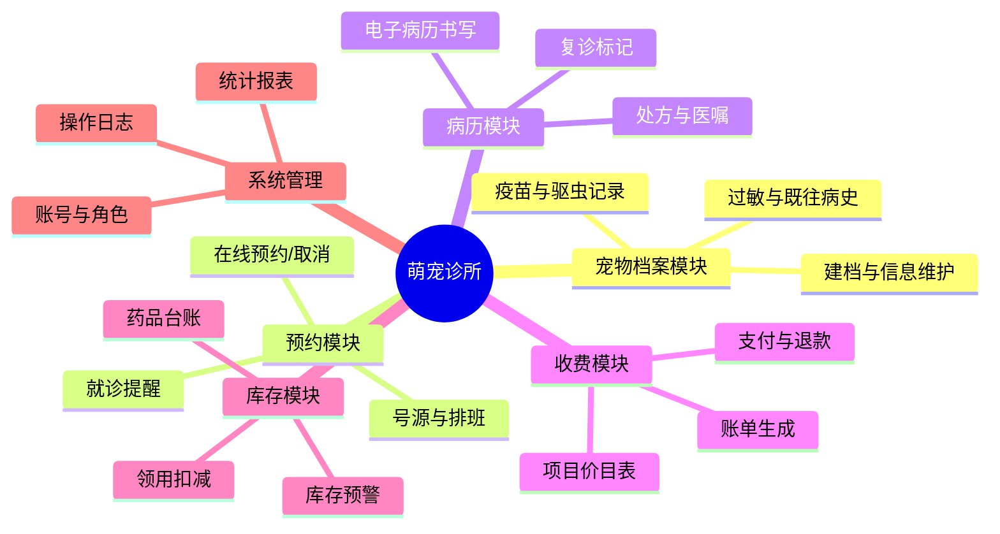
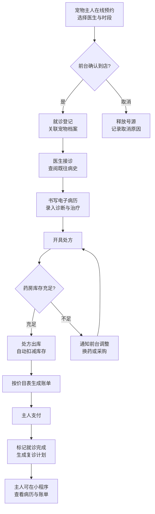

# 🐾 萌宠诊所 · 宠物医院管理系统

> 微服务课程学期项目 | 一个从单体逐步演进为微服务的宠物医院管理平台

| 项目信息 | 说明 |
| --- | --- |
| **课程** | 微服务课程（Microservices） |
| **姓名 / 学号** | 倪金博 / 2412190727 |
| **GitHub** | [nijinbo916](https://github.com/nijinbo916) |
| **项目性质** | 本课程唯一使用的个人项目，学期内持续演进 |
| **技术栈（当前）** | Java 27 · Maven · Spring Boot（后续引入） |

---

## 一、项目简介与业务背景

### 1.1 要解决的实际问题

身边带宠物去诊所的经历大致都是这样的：预约靠打电话或在微信上反复问"明天有没有号"，到了店里还要重新描述宠物的情况；宠物打过什么疫苗、对什么药过敏，全凭一张纸质病历卡，丢了就没了；收费时项目价格不透明，主人对账单有疑问也只能口头解释；药品用完了前台才发现，临时让主人换药。

**萌宠诊所系统要做的，就是把"预约 → 接诊 → 病历 → 处方 → 收费"这条完整业务链搬到线上**，让宠物主人、医生和管理员各有一套清晰的操作界面，所有数据沉淀在系统里，可查、可追、可统计。

### 1.2 目标用户及其需求

| 用户角色 | 核心需求 |
| --- | --- |
| 🧑 宠物主人 | 在线预约、随时查看宠物健康档案和历史病历、账单明细透明、收到就诊提醒 |
| 🩺 医生 / 护士 | 查看当日排班和预约队列、读写电子病历、开具处方、标记复诊 |
| 🗂️ 前台 / 管理员 | 管理医生排班和号源、办理登记与收费、维护药品库存、查看经营统计报表 |

### 1.3 选择这个题目的原因

1. **业务链完整且人人熟悉**：预约、接诊、收费每个环节都有真实痛点，不用编故事就能讲清楚需求。
2. **天然多角色**：主人、医生、管理员三套视角互不相同，后续做认证授权（JWT / RBAC）有现成的落点。
3. **模块边界清晰**：预约、病历、收费、库存天然是独立领域，适合后期逐个拆成微服务。
4. **有真实的一致性问题**：比如"同一时段号源不能超卖""收费与病历必须一致"，为消息队列、分布式事务（Saga）等课程内容提供了练习场景。

### 1.4 项目边界（初期）

**做**：单家诊所内部的预约、就诊、病历、收费、库存管理。
**不做（初期）**：多门店连锁、线上售药电商、医保/宠物保险对接、第三方宠物社区。

---

## 二、功能设计

### 2.1 功能模块总览



### 2.2 模块与功能点明细

| 功能模块 | 包含的具体功能 | 主要服务角色 |
| --- | --- | --- |
| **宠物档案** | 宠物建档（品种/年龄/体重/芯片号）、疫苗与驱虫记录、过敏史与既往病史、档案变更历史 | 主人、医生 |
| **预约管理** | 医生排班与号源管理、在线预约/改约/取消、预约状态流转（待到店/已完成/已取消）、就诊前提醒 | 主人、医生、管理员 |
| **病历管理** | 就诊登记、医生书写电子病历（主诉/诊断/治疗）、开具处方与医嘱、复诊计划 | 医生 |
| **收费结算** | 诊疗项目价目表、按处方自动生成账单、支付（现金/扫码）与退款、账单明细查询 | 管理员、主人 |
| **药品库存** | 药品入库与领用、处方出库自动扣减、低库存预警 | 管理员、医生 |
| **系统管理** | 账号与角色权限管理、经营统计（接诊量/营收/药品消耗）、操作日志审计 | 管理员 |

### 2.3 核心业务流程：一次完整的就诊



这条流程串起了**预约、档案、病历、库存、收费**五个模块，是系统最核心的主干流程，后续数据库设计和服务拆分都会围绕它展开。

---

## 三、当前范围与后续演进方向

### 3.1 当前阶段（第 2 周）

- ✅ 完成选题与功能规划（本文档）
- ⬜ 尚未编写 Java 代码，当前仓库仅包含文档与规划

### 3.2 明确暂不实现的内容

| 暂不实现 | 原因 |
| --- | --- |
| 多门店连锁与分店管理 | 超出单诊所业务边界，增加复杂度但对课程目标无增益 |
| 线上药品电商与配送 | 与"医院管理"主线偏离，属于另一个业务域 |
| 宠物保险理赔对接 | 依赖外部保险机构接口，课程内无法真实联调 |
| 买家社交/社区功能 | 非核心业务，避免功能蔓延 |

### 3.3 面向后续课程的演进规划

| 课程主题 | 在本项目中的落点 |
| --- | --- |
| **数据库持久化** | 宠物档案、预约、病历、账单的表设计与 JPA/MyBatis 持久化 |
| **认证与授权** | 主人/医生/管理员三种角色的登录鉴权，基于 JWT + RBAC 的接口权限控制 |
| **服务拆分** | 按模块边界逐步拆为：预约服务、病历服务、收费服务、库存服务、档案服务 |
| **消息队列** | 预约成功提醒、低库存预警、账单生成等异步事件通知 |
| **分布式事务** | "处方出库 + 收费入账"的最终一致性（Saga / 本地消息表） |
| **监控与可观测性** | 接诊量/接口耗时监控，健康检查与日志聚合 |
| **部署** | Docker Compose 一键部署，后续容器编排与 CI/CD |

---

## 附：仓库说明

### 目录结构

```
.
├── README.md                     # 项目入口：背景、功能设计与演进方向
├── docs/
│   └── homework/
│       ├── week-01/              # 第 1 周：环境检查与概念回答
│       └── week-02/              # 第 2 周：项目选题与功能规划
│           └── screenshots/      # README 渲染截图
└── src/                          # 后续课程项目的源代码
```

### 开发环境一览（第 1 周检查结果）

| 工具 | 版本 |
| --- | --- |
| Java | 27 (Oracle JDK) |
| Maven | 3.9.16 |
| Git | 2.55.0.windows.3 |
| Docker | 29.8.0（Docker Desktop 4.92.0） |
| Docker Compose | v5.5.1 |

详细环境检查与微服务概念回答见 [docs/homework/week-01/index.md](docs/homework/week-01/index.md)，
第 2 周选题与规划记录见 [docs/homework/week-02/index.md](docs/homework/week-02/index.md)。
